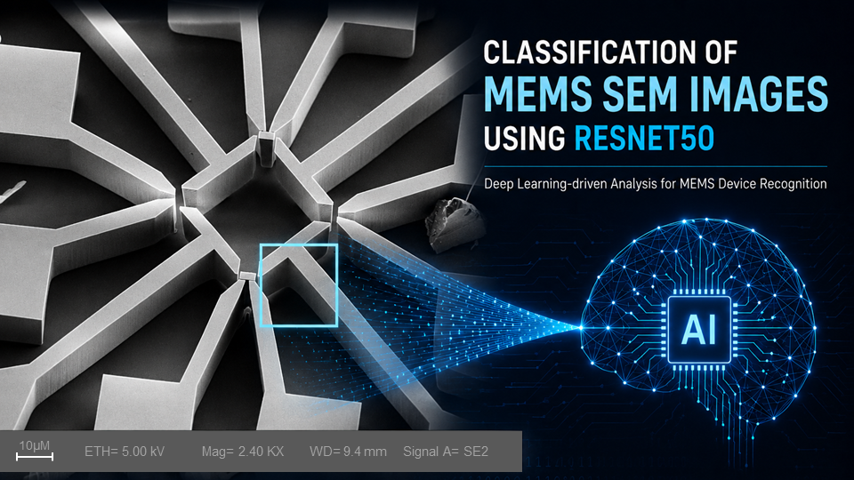

# Automated Defect Inspection in Semiconductor SEM Images

## Repository Link

[https://github.com/NezNova/Microvision-AI]

## Description

This project applies deep learning to automatically classify SEM images of MEMS structures. A dataset of SEM images was organized and labeled into eight different MEMS-related classes, and a pretrained ResNet-50 model was fine-tuned to learn and distinguish their characteristic visual features.
This classification task represents a first step toward teaching AI to understand and interpret MEMS SEM images. The long-term goal is to extend the approach beyond structure recognition toward automatic defect detection and defect classification, supporting faster and more efficient SEM image analysis and quality assessment.

### Task Type

Image Classification 

### Results Summary

#### Best Model Performance
- **Best Model:** [Name and type of the best-performing model"]
- **Evaluation Metric:** [Primary metric used, e.g., Accuracy, F1-Score, MSE, MAE]
- **Final Performance:** [Best score achieved, e.g., 95% accuracy, F1-score of 0.87, MSE of 0.12]

#### Model Comparison
- **Baseline Performance:** [Baseline model performance for comparison]
- **Improvement Over Baseline:** [Quantitative improvement, e.g., "+12% accuracy", "25% reduction in MSE"]
- **Best Alternative Model:** [Second-best model and its performance]

#### Key Insights
- **Most Important Features:** [Top 3-5 features that drive model performance]
- **Model Strengths:** [What the model does well]
- **Model Limitations:** [Known limitations and failure cases]
- **Business Impact:** [Practical implications of the model performance]

## Documentation

1. **[Literature Review](0_LiteratureReview/README.md)**
2. **[Dataset Characteristics](1_DatasetCharacteristics/exploratory_data_analysis.ipynb)**
3. **[Baseline Model](2_BaselineModel/baseline_model.ipynb)**
4. **[Model Definition and Evaluation](3_Model/model_definition_evaluation)**
5. **[Presentation](4_Presentation/README.md)**

## Cover Image

